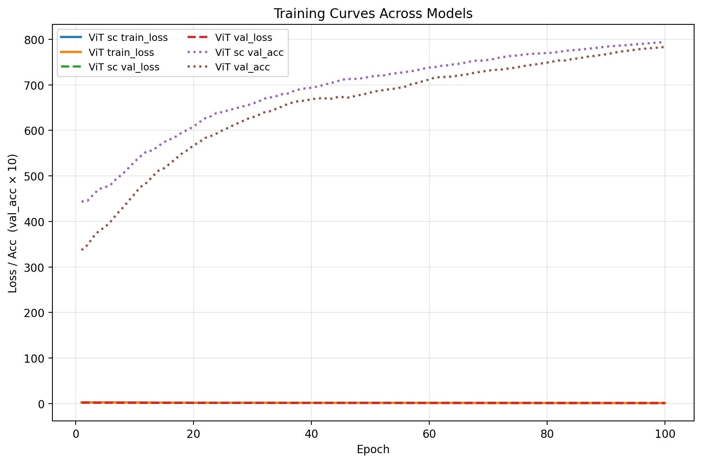

  
part_embed_dim = embed_dim // 3
```

---

## 🧪 Forward Pass (Simplified)

```python
x_raw    = PatchEmbed(x)
x_simple = SimpleGaborEmbed(x)
x_comp   = ComplexFromSimplePatches(x_simple)

x_fused  = concat([x_raw, x_simple, x_comp], dim=-1)

tokens   = [CLS] + x_fused + positional_encoding
output   = Transformer(tokens)
logits   = head(output[:, 0])
```

---

## 📚 Background

- **Hubel & Wiesel (1962)** — simple & complex cells  
- **Energy models** — phase-invariant complex-cell behavior  
- **Dosovitskiy et al. (2020)** — *An Image is Worth 16×16 Words* (ViT)

This model integrates early-vision principles into the ViT embedding stage.

---

# 📊 Experimental Results (frgfm/imagenette)

We compared:

- **Baseline ViT** (raw patches only)  
- **ViT_sc_features (ours)** with early fused V1 streams  

Dataset: *Imagenette*  
Epochs: 100  
Same augmentation, optimizer, and schedule for both.

### **Training Curves**



### **Findings**

- **Higher validation accuracy** across all epochs  
- **Faster convergence**  
- Loss curves similar (cross-entropy is compressed around small values)  
- Accuracy difference indicates superior representation learning

---

# 🧠 Why It Works

The V1-inspired streams provide:

- Robust oriented boundary detectors  
- Polarity-invariant energy features  
- Better texture & edge representation  
- Noise resistance  
- Strong inductive bias for small/mid-size datasets

The Transformer receives more meaningful initial tokens, improving final accuracy.

---

# 🚀 Usage

```python
cfg = ViTConfig(
    img_size=32,
    patch_size=4,
    in_chans=3,
    gabor=8,
    embed_dim=192,         # divisible by 3
    part_embed_dim=64,     # embed_dim / 3
    num_heads=6,
    mlp_ratio=4.0,
    depth=8,
    dropout=0.1,
    num_classes=10
)

model = ViT_sc_features(cfg)
logits = model(images)
```

---

# 📦 License

MIT License

---

# 🙌 Acknowledgements

This work builds on foundational research in:

- Early visual neuroscience (Hubel & Wiesel)  
- Complex-cell energy models  
- Vision Transformers (Dosovitskiy et al.)  
## Citation

If you use this code, please cite this repository and relevant V1 literature.


