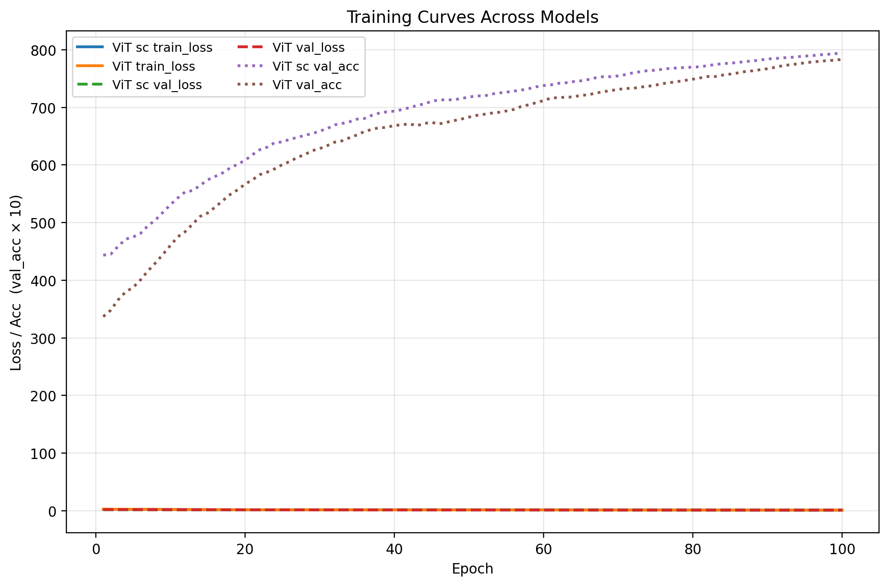

# Vision Transformer with V1 Simple/Complex Streams

This repository implements a biologically inspired Vision Transformer that integrates three early-vision feature streams—**raw patches**, **simple-cell Gabor filters**, and **complex-cell energy responses**—before feeding them into a single ViT encoder.

The model extends the standard ViT patch embedding using mechanisms inspired by **Hubel & Wiesel’s V1 simple/complex cells**.

---

## 🌟 Key Idea

Standard ViT uses *only raw patches*.  
Here, we enrich the token representation using three streams:

1. **Raw patches** (standard ViT features)
2. **Simple cell stream**  
   - fixed Gabor filters  
   - orientation-selective, phase-specific
3. **Complex cell stream**  
   - pooled odd-phase simple responses  
   - polarity-invariant boundary magnitude

Each stream produces token width **D = embed_dim / 3**, and tokens are concatenated:

```
x_fused = concat([x_raw, x_simple, x_complex], dim = -1)  # final width = embed_dim
```

This enriched token is given to a **single Transformer encoder**.

---

## 🏗️ Architecture Overview (Early Fusion)

```
Image (B, C, H, W)
   ├── PatchEmbed (raw patches)          ┐
   ├── SimpleGaborEmbed (simple cells)   ├── concatenate → fused tokens → +CLS & Pos → ViT blocks → Head
   └── ComplexFromSimplePatches          ┘
```

- Each stream width: `part_embed_dim = embed_dim / 3`
- Fused token width: `embed_dim`
- A single Transformer encoder processes fused tokens

---

## 🔧 Components

### **SimpleGaborEmbed**
- Fixed Gabor kernels over several orientations  
- Convolution → ReLU → Patch pooling  
- Produces phase-specific orientation features

### **MonocularSimpleOddGaborEmbed → ComplexFromSimplePatches**
- Odd-phase Gabor responses  
- Squared and pooled  
- Produces phase/polarity-invariant boundary energy

### **Early Fusion**
- Three streams concatenated along feature dimension  
- CLS token and positional encoding applied after fusion  
- Passed into standard ViT encoder blocks

---

## ⚙️ Configuration (`ViTConfig`)

| Field | Description |
|-------|-------------|
| `img_size`, `patch_size`, `in_chans` | Image & patch geometry |
| `gabor` | Number of Gabor orientations |
| `embed_dim` | Final ViT token width |
| `part_embed_dim` | Per-stream width (`embed_dim // 3`) |
| `num_heads`, `mlp_ratio`, `depth` | Transformer hyperparameters |
| `dropout` | Dropout |
| `num_classes` | Output classes |

**Important:**  
```
embed_dim must be divisible by 3  
part_embed_dim = embed_dim // 3
```

---

## 🧪 Forward Pass (Simplified)

```python
x_raw    = PatchEmbed(x)
x_simple = SimpleGaborEmbed(x)
x_comp   = ComplexFromSimplePatches(x_simple)

x_fused  = concat([x_raw, x_simple, x_comp], dim=-1)

tokens   = [CLS] + x_fused + positional_encoding
output   = Transformer(tokens)
logits   = head(output[:, 0])
```

---

## 📚 Background

- **Hubel & Wiesel (1962)** — simple & complex cells  
- **Energy models** — phase-invariant complex-cell behavior  
- **Dosovitskiy et al. (2020)** — *An Image is Worth 16×16 Words* (ViT)

This model integrates early-vision principles into the ViT embedding stage.

---

# 📊 Experimental Results (frgfm/imagenette)

We compared:

- **Baseline ViT** (raw patches only)  
- **ViT_sc_features (ours)** with early fused V1 streams  

Dataset: *Imagenette*  
Epochs: 100  
Same augmentation, optimizer, and schedule for both.

### **Training Curves**



### **Findings**

- **Higher validation accuracy** across all epochs  
- **Faster convergence**  
- Loss curves similar (cross-entropy is compressed around small values)  
- Accuracy difference indicates superior representation learning

---

# 🧠 Why It Works

The V1-inspired streams provide:

- Robust oriented boundary detectors  
- Polarity-invariant energy features  
- Better texture & edge representation  
- Noise resistance  
- Strong inductive bias for small/mid-size datasets

The Transformer receives more meaningful initial tokens, improving final accuracy.

---

# 🚀 Usage

```python
cfg = ViTConfig(
    img_size=32,
    patch_size=4,
    in_chans=3,
    gabor=8,
    embed_dim=192,         # divisible by 3
    part_embed_dim=64,     # embed_dim / 3
    num_heads=6,
    mlp_ratio=4.0,
    depth=8,
    dropout=0.1,
    num_classes=10
)

model = ViT_sc_features(cfg)
logits = model(images)
```

---

# 📦 License

MIT License

---

# 🙌 Acknowledgements

This work builds on foundational research in:

- Early visual neuroscience (Hubel & Wiesel)  
- Complex-cell energy models  
- Vision Transformers (Dosovitskiy et al.)  


